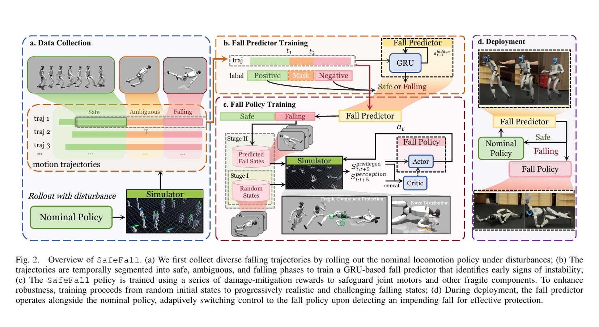
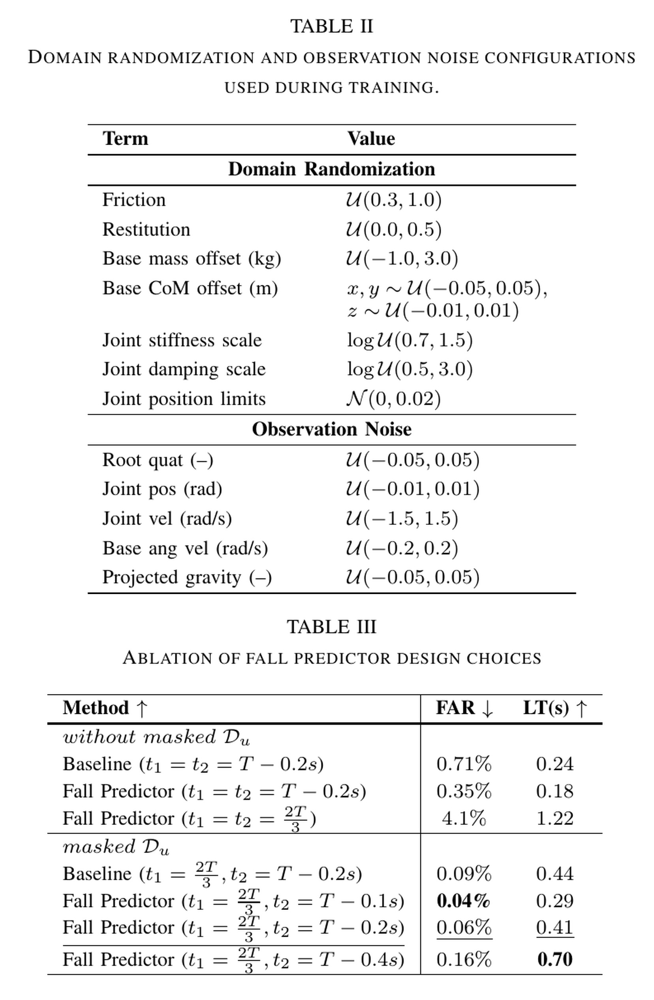
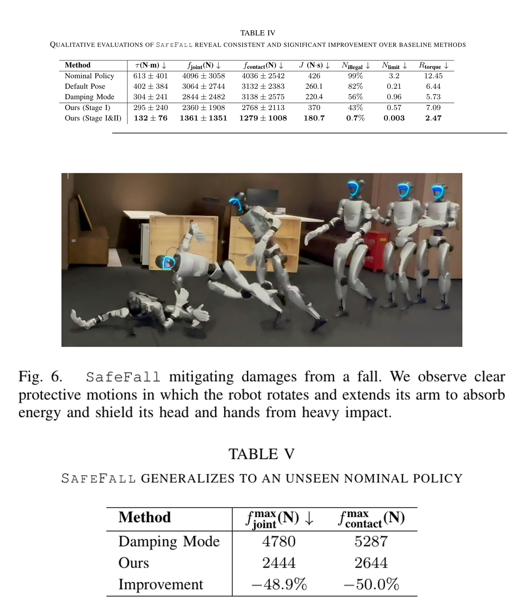

# SafeFall：只在跌倒已不可避免时接管的人形机器人保护控制

[English version](en/safefall-2511.18509v1.md)

来源：[arXiv:2511.18509v1](https://arxiv.org/abs/2511.18509v1)

公开实现状态：截至本次审计，未发现作者官方可锁定的 SafeFall 训练或部署代码仓库；本页只根据论文图表、方法和实机报告建立事实边界，不将独立推测冒充代码映射。

> 一句话结论：SafeFall 用只看本体历史的 GRU 区分“仍可恢复”和“已不可避免跌倒”，后者才从正常行走策略切到损伤缓解策略；保护策略用头/手等部件敏感权重、接触力、关节反力与力矩构成 damage-aware reward。G1 实机支持冲量下降与脆弱部件避碰，但代码未公开、平地假设、预测器跨步态需重训等边界不能被报道性降幅数字遮住。

术语导航：不可避免跌倒（unavoidable fall）、跌倒预测器（fall predictor）、保护接管（protective takeover）、损伤感知奖励（damage-aware reward）、脆弱部件（vulnerable components）、关节反力（joint reaction force）、峰值接触力（peak contact force）、误报率（false alarm rate, FAR）、提前量（lead time, LT）、非对称 actor-critic（asymmetric actor-critic）。

## 工程痛点

正常 locomotion policy 的目标是不倒，但现实中有些失足、打滑、高速撞击和状态估计错误已超出恢复包线。若继续执行走路动作，头部相机、灵巧手和执行器可能以最差姿态撞地；若轻微扰动也过早切换到跌倒动作，保护系统又会主动破坏本可恢复的正常行为。

因此问题不是只学一个“怎么倒”的策略，而是先判断何时继续恢复、何时放弃正常任务并切换为硬件损伤最小化目标；误触发会无故中断名义任务，所以预测器的误报率也是安全指标。

## 方法主线：预测与损伤缓解分开训练

数据生成从一个正常行走策略开始，在仿真中组合 1–3 种扰动：更大观测噪声、躯干速度扰动、低摩擦打滑等。论文报告得到 81,920 条轨迹，65,536 训练、16,384 验证。这些轨迹同时含动态恢复尝试和最终跌倒，才能让分类器学会两者的时序差别。

每条轨迹被分成 safe、ambiguous 和 falling 三段。中间不确定段不强行标正或负，而是从分类损失中 mask 掉；Table III 显示这一做法同时降低 FAR 并提高预警提前量。这像不迫使裁判对模棱两可的录像立即判罚：有边界的标签比伪造精确切换时刻更少污染模型。

预测器是单层 64 hidden-unit GRU，输入为本体历史，部署时不依赖全局位置或未来真值。作者选择的配置在 Table III 中给出 0.06% FAR 和 0.41 s LT；放宽 falling 起点可把 LT 提高到 0.70 s，FAR 增至 0.16%。因此阈值/分段是根据误触发代价和硬件保护需求调整的系统参数，不是只有一个普适最优数字。

保护策略训练分两阶段。Stage I 用简化碰撞几何和近地面随机姿态快速探索分散冲击的方式；Stage II 恢复完整碰撞模型，并从预测器判为不安全的真实跌倒轨迹状态初始化。这将稀疏接触信号的简单探索与最终真实初始分布分开。

damage-aware reward 不只惩罚一个身体总冲击。接触力按部件脆弱度赋权，头/手为高敏感，胫部/肩部中等，躯干/大腿/肘部较低；奖励同时看平均和峰值，鼓励用多个结实部位分散冲击。关节反力表示连接结构内部负载，力矩项保护执行器，再加关节位置、速度、加速度和 action-rate 正则减少限位冲撞与仿真振荡。

actor 只看部署可获得的骨盆横滚/俯仰、关节状态、上一动作、角速度和投影重力，叠加 5 帧；critic 在训练时可看全局根位置、速度和质心等 privileged state。这是 asymmetric actor-critic：额外信息用于价值估计，没有流入实机 actor 输入。

部署时预测器与正常策略并行，只有判为 falling 才由 SafeFall policy 替代 nominal policy。论文报告 PD 内环在仿真与实机都为 200 Hz，预测/保护策略实机 50 Hz。切换不是“叠加一个安全动作”，而是任务优先级的离散改变，因此触发延迟、动作连续性与故障默认值都需独立验收。

## 关键图解

Figure 2 的价值是显示预测和缓解用同一批自动跌倒轨迹，但学不同目标：前者学 safe/falling 时序边界，后者学冲击后果。图中的 actor/critic 观测也分开，不能在独立复现时把 critic 的未来/全局量误接给部署 actor。

Table II 给出摩擦、恢复、质量/CoM、关节刚度阻尼与观测噪声范围；Table III 比较滑动窗 MLP、GRU 和是否遮罩不确定区间。它证明 0.06% FAR 与 0.41 s LT 来自具体标签边界、模型和数据组合，不是 GRU 架构本身的普适属性。

Table IV 在 5,000 个跌倒场景上与继续 nominal、default pose 和 damping mode 对比：相对 nominal policy，峰值关节力矩、关节反力、接触力分别下降 78.4%、66.8%、68.3%，脆弱部件碰撞从 99% 降到 0.7%。但峰值 torque ratio 仍为 2.47，只由论文解释为短时峰值仍在执行器物理裕度内，不能改写成“无过载”。

## 最有说服力的实验

最重要的是 G1 实机不只展示姿态，还用高速动捕在 100 ms 窗口测量冲量：SafeFall 为 286.1 N·s，damping baseline 为 367.1 N·s，降低 22.1%。实验覆盖不同方向外推、30 cm 平台踏空和 3 m/s 跑步绊倒；保护动作包括用肘/躯干分散力、手腕翻转避免手落地。这些是实机有效性证据，但不提供逐次原始传感器数据的独立复算。

跨 nominal policy 实验揭示一个精细边界：损伤缓解策略可不微调转移到不同风格 locomotion controller，峰值关节反力和接触力分别下降 48.9% 和 50.0%；但跌倒预测器因运动特征改变而需重训。所以可迁移的是跌倒后物理处置，不是触发边界。

论文的完整 Stage I&II 在仿真中显著优于 Stage I，说明简化几何的初步策略不能直接作为最终安全策略。真实碰撞体、相邻链接假接触过滤和来自预测器的初始分布是结果的一部分，不是可在加速训练后永久省略的细节。

实验数字还要区分对哪个 baseline 的降幅。论文结论中 68.3% 接触力和 78.4% 力矩降幅以继续执行 nominal policy 为参考，而实机 22.1% 冲量降幅以 damping mode 为参考；这两组不能拼成一个“实机降低 68.3%”的表述。指标也不同：前者是仿真单次峰值接触力，后者是 100 ms 窗口冲量。手册保留这个分母差别，才能让读者正确选择设计上界。

跌倒方向的 Figure 5 表明方法在横滚/俯仰多方向普遍优于 damping，但改善并非所有方向都相同。批量验收应保存方向—速度热力图，而不只报总平均。特定几何下肘或躯干可能分散力，换一个背包、头部负载或手部工具后最优落地部位会改变。方向条件与硬件配置应是数据记录的一级字段。

## 论文—实现状态

官方代码尚未公开，因此无法核验 GRU 标签生成、PPO 损失、碰撞过滤、G1 驱动与切换状态机的具体代码符号。论文给出可审计的训练约束：预测器约 5 分钟/RTX 4090，Stage I 和 II 分别 128 与 152 GPU 小时，保护 episode 长 40，actor/critic 为 3 层 MLP。这些数字可作为复现对照，不足以重建与作者完全一致的实现。

独立实现应至少分成 `FallTrajectoryGenerator`、`TemporalSegmentLabeler`、`GRUFallPredictor`、`DamageAwareReward`、`ProtectivePolicyTrainer`、`TakeoverSupervisor` 和 `HardwareSafetyLogger`。这些名称是为了明确数据/安全契约，不是作者源码。如果日后官方仓库公开，本页应先锁定提交并替换为可点击的真实符号映射。

## 适用边界与局限

作者明确承认两个主要局限：由于冲击奖励只在跌倒末段出现，两阶段保护策略合计约 280 GPU 小时；当前仅在平地或近平地可靠，楼梯、台阶、边缘和明显不平地形的跌倒动力学不同，需视觉感知几何危险后才可扩展。

独立工程边界是：“不干扰 nominal policy”是基于预测器不误报的系统结果，不是架构必然。真机分布变化、传感器故障、新负载或新步态会改变 FAR/LT；且一旦切换，保护策略会主动放弃站立目标。必须把误触发、漏报和过晚触发当成三种不同失败。

切换监督器还必须定义故障时的确定性行为：预测器超时、连续帧丢失、分数在阈值附近往复或保护策略输出非有限数时，到底保持 nominal、进入 damping 还是触发硬件急停。论文框架聚焦学习决策，没有将所有软件故障状态形式化。实际系统要把这些分支置于学习策略之外，并通过故障注入回归测试。

损伤指标也是代理量，不是完整可靠性证明。仿真接触力和 joint reaction force 受碰撞几何、时间步和 solver 影响，实机冲量降低不等于齿轮、轴承、相机和手部的长期寿命已经建模。批量上机前仍需部件限值、冲击传感和故障检查。

论文中“脆弱部件碰撞几乎消除”也是根据事先定义的 protected region 与仿真接触统计得到。它不包含内部线束拉扯、壳体弯曲、传感器高频振动或地面尖锐物压强。给新平台建立奖励前，应先列出失效模式与可观测代理，找不到仿真代理的风险要依靠机械设计、限制场景和试验检查，不能在奖励里隐形设为零。

## 可执行但有边界的结论

最可复用的设计是把“避免跌倒”与“跌倒已确定后减少损伤”分成两个控制目标，中间用可量化 FAR/LT 的预测器作为交接。保护策略可在正常时保持 dormant，避免用损伤奖励长期拉慢行走策略。

部件脆弱权重必须来自具体机器人 BOM、更换成本和力学限制，不能照抄 G1 的分组。不同机器人的电池、计算单元、线束、头部与手部脆弱度不同，奖励的意义也随之变化。它不是纯算法超参，而是硬件风险模型。

实际项目还应设定损伤预算：同一次跌倒中，降低头手碰撞是否用更高的骨盆冲击或某个关节短时过载换来。安全验收不是把加权奖励最大化后宣布完成，而是确认每一个独立硬限都没有被总分抵消。

## 复现与验收清单

锁定 nominal policy、扰动组合概率、轨迹数据划分、safe/ambiguous/falling 标签边界、GRU 状态重置和触发逻辑。验收预测器时分别报 FAR、漏报、LT 分布与扰动类型，不能只报 accuracy；大量 safe frame 会让几乎不触发的模型也获得虚高准确率。

锁定碰撞体、solver/时间步、部件敏感权重、接触力/反力/力矩计算、Stage I/II 初始分布、域随机化和 actor/critic 观测。至少对比继续 nominal、default pose、damping、Stage I 和 Stage I&II，报全部峰值、冲量、非法碰撞、关节限位与 torque ratio，不能只选最优降幅。

实机先用吊架/软垫和低能量扰动检查切换时序，再逐步扩大方向、速度和高度。每次保存预测分数、触发时刻、接管动作、电机/电流/温度、碰撞传感与人工检查，并另建独立物理急停。保护策略不能成为惟一安全层。

> **工程判断**：SafeFall 的价值不是承诺机器人“可以放心摔”，而是将无法完全消除的跌倒风险转化为可测量的触发决策和部件损伤优化问题。
