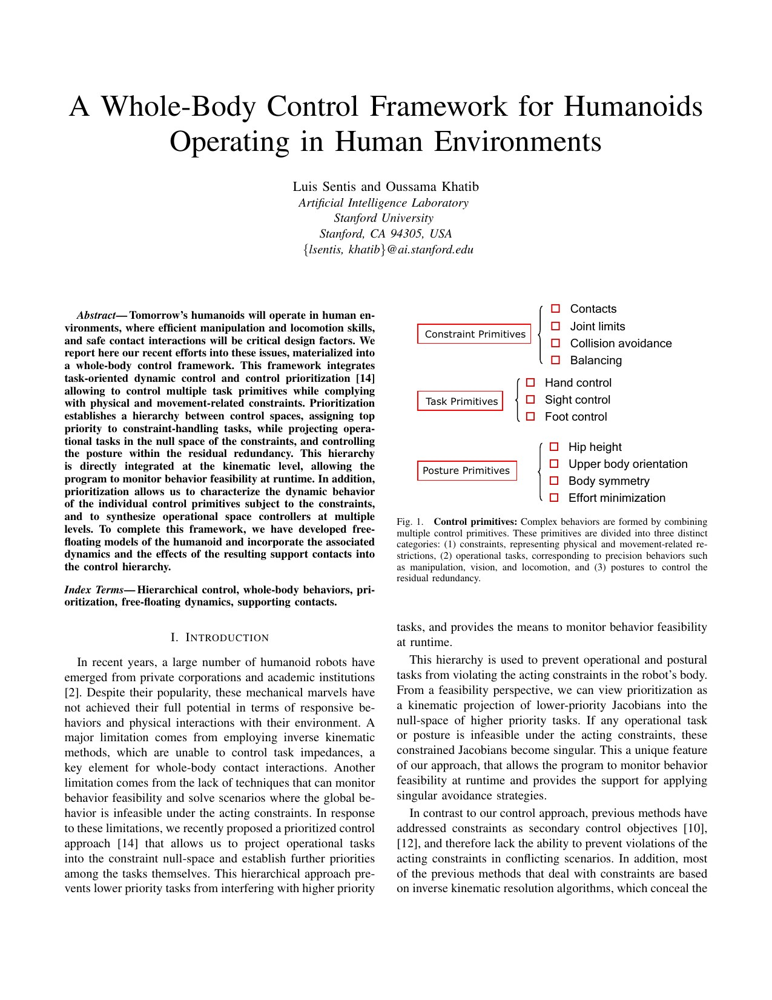
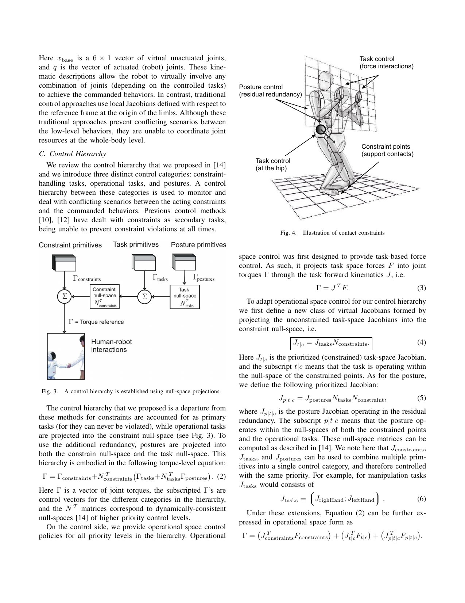
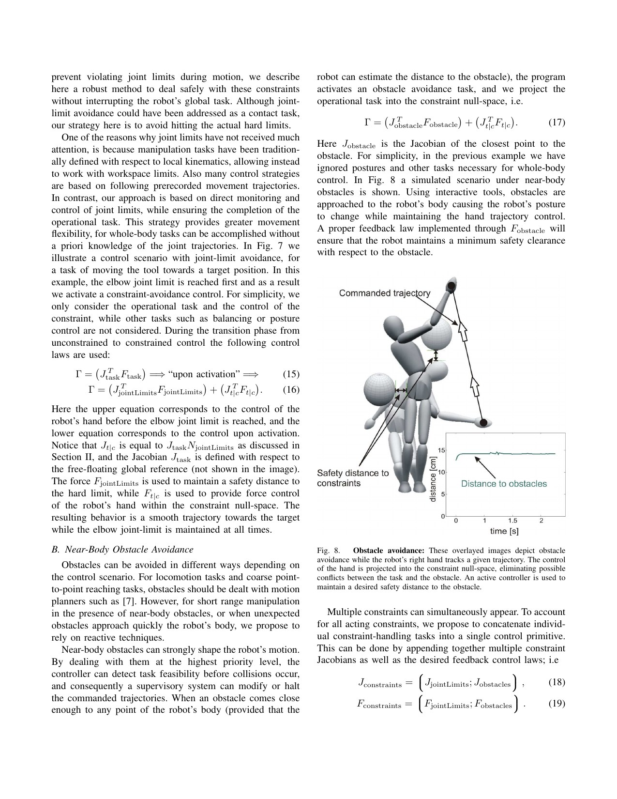
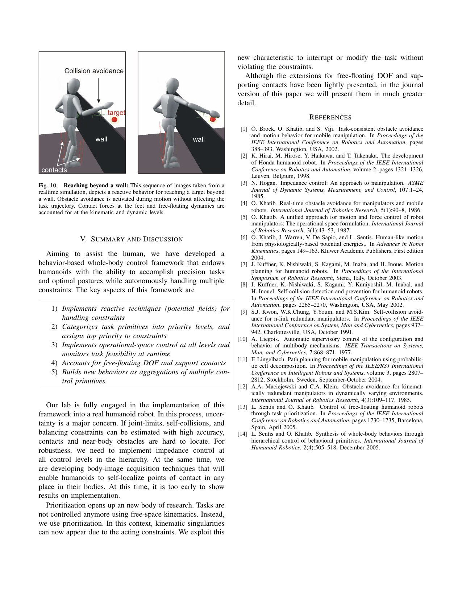

# Sentis–Khatib WBC：约束、任务与姿态如何用动力学一致零空间组成全身行为

[English version](en/sentis-khatib-wbc-2006.md)

来源：[作者公开 PDF](https://khatib.stanford.edu/publications/pdfs/Sentis_2006_ICRA.pdf)

解读范围：完整 8 页论文，包括约束优先级、操作空间力控制、关节限位/近身避障、free-floating 与支撑接触。未发现可唯一核验、与本文对应的官方代码；页面只解释论文与实现边界。

> 一句话总结：该经典框架把硬约束放在最高层，把精确任务投影到约束零空间，再把姿态目标放进剩余冗余，由动力学一致投影合成力矩；它奠定了层级 WBC 语言，但论文证据是实时仿真而非真实人形实验。

术语导航：全身控制（whole-body control, WBC）、操作空间控制（operational-space control）、约束 primitive（constraint primitive）、任务 primitive（task primitive）、姿态 primitive（posture primitive）、动力学一致零空间（dynamically consistent null space）、自由浮动系统（free-floating system）、支撑接触（support contact）与混合力/位控制（hybrid force/motion control）。

## 工程痛点

人形机器人同时需要站稳、避障、守关节限位、让手到目标并维持自然姿态。这些目标会冲突：手继续直走可能撞墙或逼近肘限位；躯干姿态可能与脚底支撑要求争夺关节。把所有误差加权相加像让安全员、操作员和造型师一起投票，足够大的任务权重可能压过安全约束。

经典逆运动学常在局部坐标逐任务解算，难以表达全身动态耦合、task impedance 和接触反力。机器人接触地面时又不是固定基座：六个 base 自由度无执行器，地面反力通过支撑点约束运动。忽略 free-floating dynamics，会得到运动学上合理、动力学上无法实现的力矩。

论文的问题因此不是求一个更大的逆矩阵，而是建立可组合的控制语法：哪些目标永远优先，哪些只在剩余空间工作，发生奇异或冲突时如何在运行时识别不可行。

## 核心洞察

作者把 control primitive 分三类。Constraint 包含接触、关节限位、碰撞避免与平衡；Task 包含手、视线和足等精确行为；Posture 包含髋高、上身方向、对称和 effort minimization。总力矩形式为 `Γ_constraints + N_constraints^T(Γ_tasks + N_tasks^T Γ_postures)`。

零空间投影可以类比在多层透明纸上作图：最高层先涂出不能改动的区域，下一层只能在透明处画任务，最后姿态只填剩余空白。动力学一致投影不只是几何正交，还考虑质量矩阵，使低优先级力矩不在高优先级 task acceleration 中产生耦合。

任务 Jacobian 先投影到约束零空间形成 `J_t|c = J_tasks N_constraints`，再计算对应 task inertia 与 operational-space wrench。若优先化 Jacobian 奇异，说明当前任务在已有约束下不可行；这种 singularity 被当作运行时 feasibility signal，而不是继续输出无界增益。

## 方法主线

Equation 2 给出约束→任务→姿态的力矩嵌套。任务层可同时放多只手；同级 task 合并为一个 Jacobian。每层使用 operational-space dynamics 产生 desired wrench，支持 impedance 与 hybrid force/motion control。论文强调约束不是软 penalty，而是决定后续可用子空间。

关节限位采用反应式 potential field：肘接近硬限位前激活 joint-limit constraint，控制力将其维持在安全距离，手部 task 被投影后仍尽量到达目标。近身障碍同理：检测 robot body 最近点与障碍距离，激活 obstacle Jacobian，再让手轨迹在剩余空间执行。

对 free-floating 人形，模型引入六个虚拟未驱动 base 坐标，并把 support contact acceleration 设为零。支撑 Jacobian 与接触反力把 base 动力学投影回 actuated joints。推导假定地面很硬、摩擦很高、支撑不滑，这是一项关键建模边界。

## 关键图解

Figure 1 把 contacts、joint limits、collision avoidance、balancing 放进 constraints，把手/视线/足放进 tasks，把髋高/上身/对称/effort 放进 posture。分类比公式更具工程价值：把安全目标放错层，调再大权重也不等价于严格优先级。

Figure 3 展示嵌套零空间，Figure 4 把支撑点、髋部 task 和姿态画在同一机器人上。Equation 2–6 说明 task Jacobian 必须先经 constraint null space，不能先各自求力矩再相加。

Figure 8 中手仍沿命令路径移动，躯干通过 obstacle constraint 绕开球形障碍，距离曲线保持安全间隔。它证明层级能在线改形，但障碍模型简单、场景仿真、没有传感误差和接触冲击。

Figure 10 是最完整组合：支撑接触、重力/角动量约束、右手位置、髋高、足 compliance、姿态和墙避障共同工作。论文明确称为 realtime simulation，并说真实机器人实现“too early to show”；因此图不能当硬件证据。

## 最有说服力的实验

最强证据是 Figure 10 的多 primitive 组合以及 Figure 7–8 中关节限位/障碍动态激活后，手任务被连续重定向而没有直接中断。这说明层级结构能把新约束插入已有行为并保持其余任务。

但论文没有定量 tracking error、约束 violation、循环频率分布、扰动范围或真机重复实验。所谓 runtime feasibility 主要来自 Jacobian singularity 与仿真演示，尚未覆盖模型误差、摩擦锥、时延和接触切换。

## 论文—实现状态

本文没有可唯一核验的官方公开代码，无法给出可信的固定提交与函数映射。作者引用先前 operational-space 与 prioritized control 工作，但将任意现代 WBC 仓库标成“本文代码”会混淆二次实现与原始证据。

与本文一一对应的官方代码尚未公开。后续实验室软件或第三方层级控制器只能作为复现参考，不能替代原论文实现证据。

复现应独立实现：质量矩阵和 bias、constraint/task/posture Jacobian、动力学一致广义逆、嵌套投影、support selection 与 wrench。每个矩阵要记录 frame、维度、rank 和 damping；在接近 singularity 时使用可解释的降级策略，不能只依赖数值求逆成功。

## 局限与工程判断

作者明确承认：真实人形实现尚无结果；joint limit、self-collision 和 balance constraint 的可靠估计仍是难题；多个 constraint 合并后彼此排序是否必要尚不清楚；free-floating 与 support contact 只做初步展示，期刊版本计划进一步展开。

独立工程局限还包括：硬地面/高摩擦假设忽略足滑；potential field 可能产生局部极小或高频激活；等优先级任务内部仍可能冲突；纯层级不处理 torque、friction cone、CoP 和 actuator rate 的统一不等式；矩阵 rank 在接触切换处不连续。

硬件安全上，WBC 输出前必须做 joint/torque/rate limit、contact wrench、摩擦锥、CoP 与 self-collision 检查。约束估计失效或 rank 突变时应进入平衡/停机降级。墙体和人体附近的避障不能只靠理想距离，要考虑感知时延、几何膨胀和急停距离。

## 可执行但有边界的结论

最可复用的是“任务分层先于权重调参”。先写安全不可违反项，再写行为目标，最后写冗余姿态；每一层都定义 infeasibility 与 fallback。若所有目标塞进一个加权 cost，系统很难解释为什么安全项在某个场景被牺牲。

现代 QP/HQP 可把 torque、接触与 friction inequality 更直接纳入，但仍继承本文的优先级问题。算法形式可以变化，约束/任务/姿态的职责与证据边界不应丢失。

## 复现与验收清单

从固定基座 2–3 task 单元测试开始，检查 `J N`、动态一致广义逆与高层 task acceleration 不受低层力矩影响。构造 rank-deficient Jacobian、冲突任务与接近关节限位，验证 bounded output、激活迟滞和明确 infeasible flag。

加入 floating base 与单/双支撑，核对 selection matrix、support acceleration、contact wrench 和能量。仿真注入质量/摩擦误差、时延、接触点偏置、足滑和感知障碍延迟，报告 task error、constraint violation、rank、condition number、torque 与循环 deadline miss。

真机从低力固定基座、单手 task、静态双支撑逐级到接触切换；使用系留、软限位、独立 watchdog 和急停。每次新 constraint 激活都记录优先级、projection rank 与降级原因，确保“约束优先”在日志和硬件上都可验证。

## 进一步工程审计

层级控制首先需要统一坐标约定。手任务、障碍最近点、支撑接触与质心若分别在世界、基座或局部坐标计算，雅可比即使维度正确也可能对应不同物理量。每个任务应显式声明参考系、表达系、控制点和时间戳，并用有限差分验证雅可比。小型姿态下看不出的符号或坐标错误，会在大范围全身动作时变成高力矩冲突。

零空间投影还要检查数值幂等性和动态一致性。理想投影连续应用不应继续改变向量，高优先级任务受低层力矩影响应接近数值容差。实际质量矩阵条件数、阻尼和关节尺度会破坏这些性质，因此测试需要覆盖不同姿态、负载和接触数，并记录投影残差。只验证求解器没有报错，无法证明优先级真的成立。

约束激活必须有进入和退出迟滞。关节在阈值附近、障碍距离带噪或足接触反复切换时，若每个控制周期改变活动集，力矩会产生高频抖动。工程实现应设置预警区、激活区和释放区，限制约束力增长率，并在日志中保存触发测量。这样才能区分“控制器振荡”和“传感器阈值反复穿越”。

同级任务冲突不能藏在广义逆里。两只手要求不可同时满足的位置时，拼接后的雅可比可能降秩；求解器仍给出最小二乘答案，却没有说明哪只手被牺牲。应为同级任务定义误差归一化、最大允许偏差和冲突报告，必要时由上层重新排序或降低任务，而不是依赖数值阻尼静默平均。

支撑接触模型必须从理想等式扩展到现实不等式。足不滑要求切向力处于摩擦锥，压力中心位于支撑多边形，法向力非负，执行器和关节也有上下界。原论文的零加速度支撑与高摩擦假设适合建立理论结构，现代实现若不加入这些条件，可能在数学上维持支撑、物理上要求地面提供不可能的拉力或摩擦。

实时性要报告最坏情况而不是平均循环频率。接触增加、矩阵接近奇异、障碍约束激活时计算量和条件数往往同时上升，恰好也是安全最关键时刻。应测量各层建模、分解和求解耗时的高分位，设置硬截止与上次安全输出策略，并验证截止发生时不会继续积累积分或发送过期力矩。

最后，行为可行性和系统安全要分开。优先化雅可比奇异能说明当前局部任务无法在约束下实现，却不能发现模型参数错、传感器冻结或结构损伤。需要独立监测状态估计一致性、接触观测、电机健康和通信；控制层报告“可行”只代表其数学模型内可行，不能成为绕过硬件保护的理由。

模型更新也必须与控制周期隔离。质量矩阵、接触雅可比和障碍距离可能来自不同线程，若控制器在同一周期混用新旧状态，优先级计算即使公式正确也对应一个不存在的机器人状态。应为整套动力学快照分配时间戳和版本号，只在完整更新后原子切换；超过时效的感知量进入保守边界或暂停相关任务。日志需能重建每次求解实际使用的快照，才能在事后区分建模误差、并发错误与求解器数值问题。

调试顺序应从最高优先级向下。先单独验证支撑、限位和避障始终满足，再加入一项操作任务，最后开放姿态冗余；一开始就运行完整行为会让低层补偿掩盖高层错误。每新增一层，比较已有层的误差和力矩是否保持在容差内。这种递增验收与论文的层级结构一致，也能把复杂全身故障分解成可重复的小问题。

> **工程判断**：这篇论文最经典的不是某个矩阵公式，而是明确告诉控制器——哪些目标可以妥协，哪些目标根本没有投票权。
