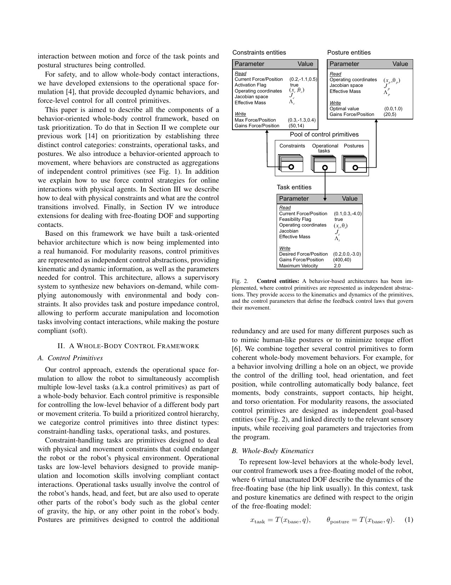
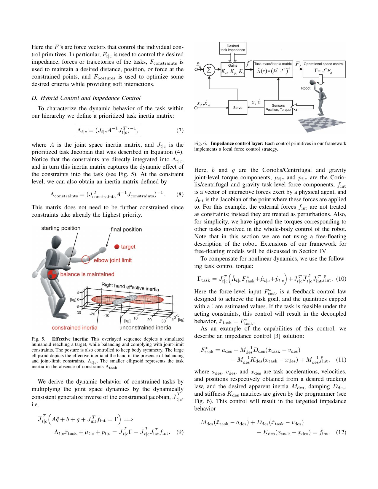

# Sentis–Khatib 2006：WBC 的核心不是多做几个任务，而是让约束拥有真正的优先级

[English version](en/sentis-wbc-2006.md)

来源：[作者公开 PDF](https://khatib.stanford.edu/publications/pdfs/Sentis_2006_ICRA.pdf) · 论文：*A Whole-Body Control Framework for Humanoids Operating in Human Environments*，ICRA 2006，共 8 页。

公开实现状态：截至本次审计，该论文的作者官方实现尚未公开，未发现可锁定提交与论文逐项对应的源码；本文不把后来的第三方 WBC 库当成原论文官方代码。

> 一句话结论：论文把约束、操作任务和姿态放入动力学一致的严格层级，使低优先级命令只能使用高优先级剩余自由度；这为“任务冲突时谁让步”提供了结构化答案，但并不自动解决约束测量误差、数值奇异和硬件力矩限幅。

术语导航：操作空间控制（operational-space control）、任务优先级（task priority）、零空间投影（null-space projection）、动力学一致性（dynamic consistency）、约束原语（constraint primitive）、操作任务（operational task）、姿态任务（posture task）、有效惯量（effective inertia）、阻抗控制（impedance control）、浮动基座（floating base）。

## 工程痛点

人形机器人同时面对平衡、支撑接触、关节限位、避碰、手部轨迹、视线和姿态。若把所有误差简单加权成一个代价，权重会隐式决定优先级：手部误差稍大就可能牺牲关节限位或平衡。不同任务单位也不同，米、弧度和力矩权重很难凭一个总损失稳定解释。

Sentis 与 Khatib 提出三类控制原语：不能被低层行为违反的约束；精确完成操作、视觉、行走等目标的 operational tasks；只利用剩余冗余塑形的 postures。可以把层级类比成操作系统权限：高权限约束先占用资源，普通任务只能访问留下的自由度，姿态优化最后使用剩余空间，而不是大家对同一关节“投票”。

## 方法主线：从运动学投影到动力学层级

约束 Jacobian 定义当前不能朝哪些方向运动。任务 Jacobian 先投影到约束零空间，形成 `J_t|c = J_tasks N_constraints`；姿态再投影到约束与任务的剩余零空间，形成 Equation 5 的 `J_p|t|c`。当任务在当前约束下不可实现时，投影后的 Jacobian 会失去秩，系统可以显式检测冲突，而不是由大关节速度或力矩间接暴露。

Equation 2/7 将控制量按层级组合：约束贡献直接作用，任务贡献经过约束零空间，姿态贡献再经过任务零空间。关键不是写出多个控制器，而是每一层的输出不能重新激发更高层已约束方向。若使用普通欧氏伪逆而非动力学一致逆，运动学上“正交”的动作仍可能通过惯性耦合影响高优先级任务。

同一优先级内部可以把多个 Jacobian 纵向堆叠，例如双手任务作为一个 task category 同时求解；严格层级则用于不能等价交换的目标。设计时先问“两个目标冲突时是否允许相互折中”：允许则放同层并明确尺度，不允许则分层。把每个小目标都建成独立层会让后层几乎没有自由度，也会放大伪逆数值噪声。

论文定义考虑约束后的 task inertia `Λ_t|c`。Figure 5 表明相同手部方向在有平衡/关节约束时看到的有效惯量会改变。阻抗控制因此必须在受约束任务空间中计算，而不是先设计一个自由空间手臂阻抗，再假设全身支撑不会改变它。

对浮动基座人形而言，地面反力和驱动力矩共同产生广义加速度，基座六自由度不能像固定机械臂关节那样直接施加力矩。论文后半通过支撑 Jacobian、驱动选择矩阵和 support null space 把这一事实并入层级。可以把支撑接触看成机器人临时获得的“地基”：地基位置与方向改变后，手端看到的惯量和可用控制方向也随之改变。

每个任务可以给期望加速度、力或轨迹，并配置表观惯量、阻尼和刚度。Equation 11 表达 task-space impedance：跟踪误差与外力共同决定任务力。作者把交互力视为扰动，而将支撑、限位和障碍等不可违反条件放在约束层；这种分类决定系统行为，必须由工程需求明确，而非由代码类名默认。

## 关键图解

Figure 1 将复杂行为拆成 constraint、operational task 和 posture 三类，Figure 2 展示原语参数与管理结构。图的价值是给出可组合的软件契约：每个原语提供 Jacobian、目标和控制量，再由层级聚合。它没有证明任意组合都数值稳定，冲突和奇异仍需监控。

Figure 3 与 Equation 4-7 是论文核心。低优先级箭头逐层穿过高优先级 null space；若手部目标与避碰/关节限位冲突，手部只能沿不违反约束的方向运动。这比给避碰一个很大权重更可解释，但也更依赖准确 Jacobian 与秩判断。

Figure 5 的惯量椭球显示约束会改变手部动态响应；Figure 6 将期望惯量、阻尼、刚度和外力闭合到 task-space 控制层。它支持“接触/支撑必须进入任务动力学”这一机制，图中仍是框架与仿真示意，不是现代力控硬件上的频响测量。

## 最有说服力的实验

论文最有价值的实验证据是多个近身障碍同时出现时，最高优先级约束改变身体与手部可行方向，而操作目标和对称姿态继续使用剩余自由度。Figure 8/10 的仿真说明行为不需要在每次障碍出现时停止全部任务；控制器可以退化为“尽量完成不冲突分量”。

另一个关键事实是投影任务的奇异性可作为 infeasibility signal。普通未投影 Jacobian 在目标本身几何上可达时可能仍是满秩，却忽略了当前约束；`J_t|c` 的秩下降更直接反映“在不违反高优先级条件下不可达”。实际系统需要对奇异值设置迟滞阈值，否则接近边界会频繁切换。

不可行时还需要明确降级策略。最简单做法是舍弃投影 Jacobian 的奇异方向，仅执行其可实现分量；也可以降低目标速度、冻结参考、重新规划或要求监督器停止任务。RankMonitor 只负责发现问题，不能决定业务上是否应继续。日志应保存被舍弃方向、持续时间与触发约束，否则表面上“机器人没撞”却无法解释任务为何长期偏离。

论文末尾明确指出支撑接触只做了较轻量呈现，精确接触定位困难，未来需要所有层级的阻抗与接触自定位。作者没有报告真实人形机器人上的统计实验、力矩/频率数据或与 QP-WBC 的对照。因此应称其为经典框架与仿真证据，而不是完成度等同于今日实机控制栈。

## 论文—实现状态

作者官方实现尚未公开，以下是依据论文接口建议的模块，不是源码事实：`ConstraintSet` 聚合限位、避碰和支撑 Jacobian；`DynamicConsistentInverse` 计算惯量加权逆与 null-space；`TaskHierarchy` 按 Equation 2/7 组合层级；`OperationalSpaceImpedance` 计算 `Λ/μ/p` 与期望阻抗；`RankMonitor` 监测投影 Jacobian 奇异值并触发降级。

最小实现要先验证投影不回扰：随机生成正定惯量矩阵与 Jacobian，检查低优先级力矩经动力学映射后在高优先级方向上的加速度接近零。然后测试任务重排、相同优先级堆叠、秩亏、阻尼伪逆和约束启停连续性。只检查 `J N≈0` 的运动学等式不足以验证 dynamic consistency。

现代库常用 QP/层级 QP 表达不等式限位、摩擦锥和力矩界；这与本文投影框架有思想连续性，却不是同一实现。引用第三方库时应明确“受论文启发”还是“逐式复现”，并锁定版本、求解器容差和约束软化策略。

## 适用边界与局限

作者的核心假设是能构造可靠约束/任务 Jacobian、机器人惯量和支撑接触模型。障碍距离、接触点或基座状态有偏差时，最高优先级并不等于真实物理安全：控制器只会严格满足它所看到的错误约束。感知置信度与保护裕量必须进入约束生成层。

独立工程判断是：严格优先级会造成低优先级任务在边界附近突然失去方向，带来命令不连续；阻尼伪逆虽能平滑奇异，却会泄漏高优先级误差。约束激活应使用距离缓冲、连续权重或状态机，并分别记录约束残差与任务损失，不能用一个总误差掩盖泄漏。

控制频率和矩阵分解时间也是实机边界。任务数、接触数和奇异值分解会改变最坏计算时间；平均循环频率正常不代表约束激活瞬间不会超时。应在最大任务/约束组合上测 P99 和最坏时延，并验证超时分支输出保持、阻尼或安全姿态，而不是重复过期的高力矩命令。

论文 torque-level 表达也没有自动包含执行器饱和。若组合力矩超限，驱动器裁剪会破坏理论投影关系，使所有层级同时偏离。需要在控制分配中显式加入力矩/速度/功率限制，或由更高层 QP 处理；否则“数学优先级”到电机处会被非结构化截断。

## 可执行但有边界的结论

这篇论文最适合作为 WBC 任务架构基线：每个目标必须标明是硬约束、操作任务还是姿态偏好；每次冲突必须能解释哪个层级让步。若系统仍靠调大权重保护关节限位，应先检查是否需要结构化优先级，而不是继续扩大权重范围。

对于需要摩擦锥、单边接触和力矩不等式的现代人形机器人，可保留同一优先级语义，在层级 QP 中实现。迁移时要保持证据边界：本文证明的是投影层级与受约束操作空间机制，不是某个现成 QP 参数或任何机器人上的安全保证。

## 复现与验收清单

仿真验收至少覆盖：无遮挡正常跟踪、单/多障碍激活、关节限位与手部目标冲突、支撑变化、任务奇异、模型质量偏差和力矩饱和。逐层画约束残差、任务误差、姿态误差、奇异值、投影泄漏和命令连续性，并对约束启停做最坏瞬态测试。

还应加入反例测试：交换两个严格层级后结果必须按预期变化；移除约束投影后应能观察到更高层残差恶化；用普通伪逆替换动力学一致逆后，应量化动态耦合而不是只比较姿态截图。这些对照像给层级做“断路器测试”，能证明保护作用来自结构，而非刚好没有发生冲突。

实机前必须加入机器人专用关节/速度/力矩限幅、碰撞保护、通信超时、急停和隔离区；接触任务从低刚度、低速度开始，测量实际阻抗而不是只读取设定值。本文不提供可直接上机的增益、约束距离或力矩限制，仿真框架不能替代现场安全评估。

> **工程判断**：WBC 的可维护性来自“冲突时谁让步”是结构事实，而不是一组只有原作者会调的权重。
