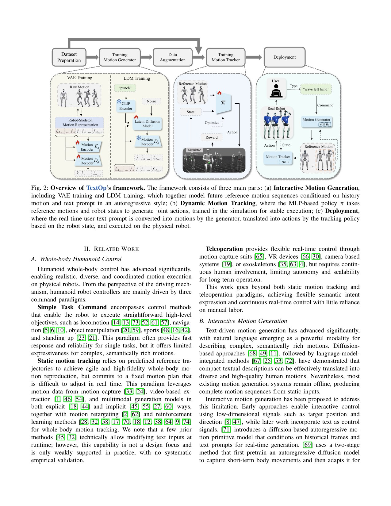
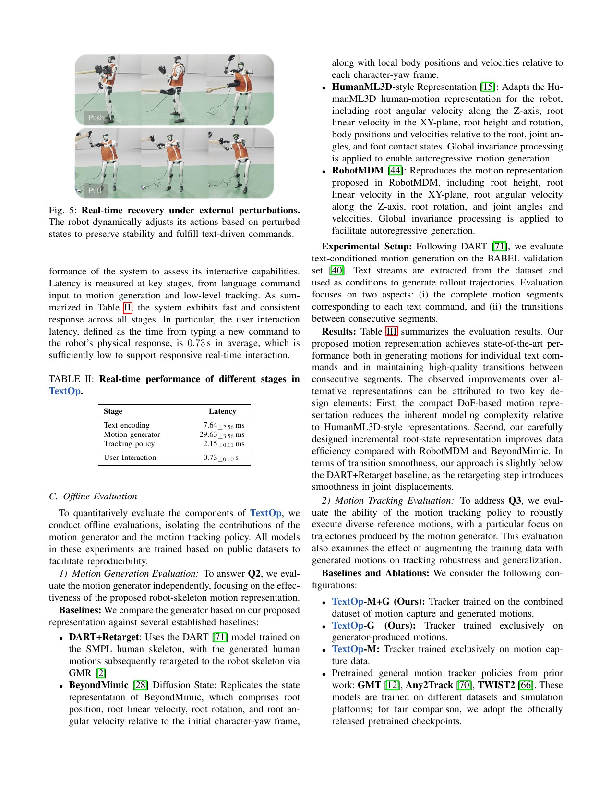
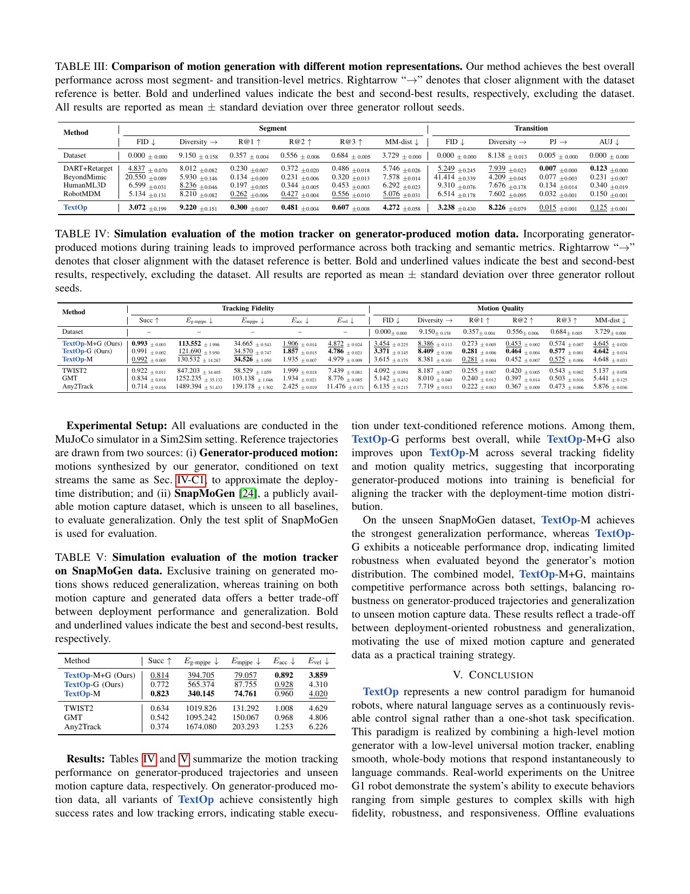

# TextOp：把可随时修改的文字流变成连续人形运动

来源：[arXiv:2602.07439v1](https://arxiv.org/abs/2602.07439v1) · [固定提交官方代码](https://github.com/TeleHuman/TextOp/tree/ef6555fb174c9b5c44945a62c7ffc77b5ddbbf22)

解读范围：完整 20 页正文与附录。

> 一句话总结：TextOp 用高层短块文字条件扩散持续生成 G1 参考运动，再交给一个同时见过 MoCap 和生成运动的鲁棒 tracker，因而用户可在机器人运动中随时更换文字。

术语导航：流式文字控制（streaming text control）持续接收新指令，动作块（motion chunk）只生成短未来。扩散 Transformer（diffusion transformer）、分类器免引导（classifier-free guidance, CFG）、自回归历史（autoregressive history）、机器人骨架表示（robot-skeleton representation）、分布增强（distribution augmentation）和上下层解耦（hierarchical decoupling）是理解延迟与失败的关键。

## 工程痛点

传统 text-to-motion 往往接收一句文字，一次生成一整段人体动作。机器人在执行中如果收到“现在改成挥手”，重新生成整段会丢掉当前相位，直接拼接又容易在根位姿、支撑脚和关节速度上产生跳变。因此“可以根据文本生成动作”还不等于“可以连续驱动真机”。

TextOp 像一名边听导演口令边表演的演员：每次只安排一小段未来，但必须记住刚才做到哪里，才能把新口令接上。历史帧提供这个“现在在哪里”，短块则限制每次更改的时间范围。

第二个问题是人体生成运动并不一定是机器人跟踪器的训练分布。即使经过 GMR 重定向，生成器的过渡、频率和误差仍与 MoCap 不同。一个只追真实捕捉动作的 tracker，可能在看见生成器小偏差时累积误差；混合训练是为了让低层认识真正会收到的上层分布。

## 核心洞察

TextOp 的第一个洞察是不必为每次文字更新重置生成状态。文字 embedding 可以更换，但最近机器人骨架历史继续作为条件；因而语义可变，物理起点不跳。这个接口将“用户想做什么”和“机器人当前做到哪里”分成两个状态。

第二个洞察是直接生成机器人骨架可以避免“生成人体 → 事后重定向”的二次分布变换。但机器人表示仍然不保证物理可执行，它只把关节数量、根表示和时序语义对齐到 tracker 接口。低层闭环跟踪仍是把动作变成实机行为的关键层。

第三个洞察是“生成增强”不会在所有分布上单调变好。Table IV/V 中混合数据改善生成分布，在未见 SnapMoGen 上仅 MoCap 反而最好。这像让司机在测试路段反复练习：它能提高该路段表现，也可能降低对另一类道路的注意力。

## 方法主线

TextOp 的高层不是一次生成整段动作，而是每次用最近机器人骨架运动和当前文字生成短 horizon：BABEL/AMASS 先由 GMR 重定向并过滤到 G1，构成 83,478 个片段—文本对；Transformer VAE 编码未来运动，文本经 CLIP，扩散 Transformer 用 5 步去噪和 CFG=5 生成潜变量，再结合历史解码未来机器人关节/根运动。高层 6.25 Hz 在外部工作站运行。

低层 PPO 跟踪生成参考，50 Hz 在 29-DoF G1 机载计算机运行；训练数据同时含 MoCap 与生成运动，以降低生成器—跟踪器分布差。用户修改文字时只更新文本 embedding，后续块继续从最新历史自回归生成，因此无需中断控制器。

## 关键图解

Figure 2-3 要区分三个时钟：用户更新文字的事件时钟、高层 6.25 Hz 生成时钟和低层 50 Hz 跟踪时钟。高层不必与每个控制步同步执行，因为它预先生成运动块；低层在块之间维持闭环，避免生成计算抖动直接变成关节抖动。

- Figure 2/3：文字流—自回归生成—低层跟踪，以及文本/SMPL/机器人运动的时间对齐数据。
- Table I：30 秒实机流式命令中，随机组合 16/20 成功；循环 punch 与 guitar/violin 10/10，wave 8/10。失败标准是不能完成或触发安全终止，不等于语义完美。
- Table II：文本编码 7.64 ms、生成 29.63 ms、跟踪 2.15 ms；从键入到观察到机器人响应为 0.73±0.10 s（10 次人工感知测量）。
- Table III：机器人骨架表示在大多数片段/转换指标优于 DART+Retarget、BeyondMimic 表示、HumanML3D 和 RobotMDM；DART 重定向在部分转换平滑指标更好。
- Table IV/V：混合 MoCap+生成数据的 tracker 在生成分布上全局误差低于仅 MoCap；但未见 SnapMoGen 上仅 MoCap 反而泛化最好，说明生成增强有分布权衡。
- Appendix Table VI-X：2 帧历史、8 帧未来、5 diffusion steps、431/557 维跟踪观测和 200/50 Hz 仿真/策略频率。

Table I-II 必须合读：前者给出 30 秒流式试验的成功分母，后者把文本编码、生成、跟踪计算与人看到响应的端到端时间分开。0.73±0.10 s 是人感交互响应，不是低层控制循环延迟；混淆两者会误判系统稳定性。

Table III 比较机器人骨架与人体生成/重定向管线，Table IV-V 比较 tracker 训练数据。它们共同说明高低层之间的表示和数据分布是接口的一部分，却也暴露混合训练的泛化权衡。因而评估要同时保留生成分布和未见生成器分布。

最强证据是 Table I+II：真实 30 秒连续试验有明确分母，并把计算延迟与人感响应分开。它支持“可交互”，但 0.73 s 不是控制回路延迟，也不保证任意文字能生成安全动作。

## 最有说服力的实验

Table I 将试验固定为 30 秒连续文字流，并对随机组合与循环动作分开统计。随机组合 16/20 说明切换还是主要难点，而 punch 与乐器类循环更稳，与自回归生成容易维持周期模式的性质相符。这是有分母的闭环能力证据，不只是动作视频。

Table II 将端到端交互分解为可优化部件：文本编码 7.64 ms、生成 29.63 ms、跟踪 2.15 ms，与 0.73 s 人感响应之间的差距主要来自块调度、发布和动作可观察性。要进一步改善交互，应分别改这些环节，而不把所有时间简写成“模型推理延迟”。

## 论文—代码映射

| 组件 | 固定提交符号 | 对应关系 |
|---|---|---|
| CFG 去噪 | `ClassifierFreeWrapper`、`generate_next_motion` | 组合有/无文本条件扩散，输入文本 embedding 与历史，输出下一运动块 |
| 文本/历史条件 | `DenoiserTransformer.forward` / `mask_cond` | 嵌入扩散时刻、CLIP 文本、历史运动与噪声潜变量 |
| 在线生成 | `MotionDAR._gen_motion` / `_update_text_embedding` | 生成后保留尾部历史；键盘更新文字 embedding 而不重置整个执行链 |
| 发布节奏 | `MotionDAR.loop` / `_publish_motion_block` | 预生成未来块并通过 ROS 消息交给下层跟踪 |

官方仓库为 MIT，但 README 明确说“latest code and dataset are not yet updated”；固定提交是可查实现，不应假设与论文 v1 所有表格完全一致。

## 局限与安全边界

作者明确指出 TextOp 不感知环境几何，无法针对障碍、地形或动态物体改动作，未来需环境感知与交互规划。独立判断：CLIP/BABEL 词汇与私有少量数据限制开放文本；连续自回归可能积累漂移；随机组合 20 次仍属小样本；手动推扰只有定性展示；用户文字可能语义含糊或危险，系统没有文本级安全规划证明。

开放文本还存在语义不确定性：“快速转身”没有指定旋转方向、角度、空间和停止条件。生成模型可以选一个常见解，却不知道该解在当前环境是否安全。因而上层必须有命令解析、可达性检查和拒绝机制，不能把 CLIP 相似度当成任务规格。

## 可执行但有边界的结论

适合复用的是“流式短块生成 + 独立鲁棒 tracker + 生成分布增强”的架构。验收应分开单动作循环、语义相近切换、语义相反切换与长时间自回归，同时报告语义成功、跟踪失败和安全终止。

上线必须给命令白名单/拒绝逻辑、空间与速度限制、环境感知和低层安全监督，且把生成延迟、交互延迟、跟踪延迟分别监测。

## 复现与验收清单

容易误读的第一点是把 5 步扩散去噪当成五个控制周期。它是高层一次生成内的数值步，生成频率、块长度与低层跟踪频率是另外三个时序概念。复现文档应在一张时序图中将四者并列，防止用去噪步数错误推导实机发布延迟。

第二点是将 30 秒成功当成长时间稳定性。自回归漂移可能在更长时间内累积，而周期动作的循环结构又可能暂时掩盖根位姿偏差。评估应增加数分钟长流、频繁文字切换和静止收束，检查系统能否从运动流安全返回稳定姿态。

第三点是将语义相似度当成物理成功。动作可能在文本分类器上很像“打拳”，却因地面、障碍、人体或关节限位而不可安全执行。语义、跟踪和环境安全应作为三个独立验收轴，任何一个不合格都不应发布动作。

数据复现应将原始 BABEL/AMASS 片段、文字标注、GMR 重定向、质量过滤和最终训练对逐层记录。每一层要给出片段数、时长、词汇覆盖、动作类别与删除原因。只报 83,478 个最终对无法判断某个文本失败是语义数据缺失，还是动作因机器人不可达被过滤。

流式生成的单元测试要覆盖三类切换：语义相近的过渡，如走到快走；周期到非周期，如走到挥手；语义相反或支撑冲突，如前进到突然后退。每个切换需检查根位姿连续、支撑脚、关节速度、文本语义分数和 tracker 终止，不能只由人看是否自然。

高层与低层的时钟应分开打点：文本提交、embedding 更新、去噪开始/结束、motion block 发布、tracker 接收与实机动作首次可见。除了均值和标准差，还应报告尾部延迟、队列深度、块过期与丢包。这能区分生成模型慢，还是调度等待造成交互迟钝。

跟踪数据消融要在至少三个分布上评估：真实 MoCap、训练生成器的输出，以及未见生成器/新文本组合。只 MoCap、只生成与混合数据应使用相同样本总数和训练预算。若混合方法只在自己生成器上改善，就应把它定义为接口适配，而不是通用 tracker 增强。

上线前需建立从文本到动作的约束编译层：允许的动作词、幅值、速度、空间、期限和停止条件，以及不可达或危险命令的拒绝回复。然后才让生成器处理已经定界的动作类。这层与碰撞、限位和急停监督器独立，任何一层拒绝都应阻止动作发布。

开放词汇评估还应包含无法对应训练动作的文字、多义指令、否定命令和带空间约束的命令。当生成器没有可靠动作时，系统应输出不确定或拒绝，而不是用最近训练语义生成一个看似合理的动作。这一点可通过文本重述一致性、多次生成方差、跟踪可行性和人审分类共同测量。只在已知动作名称上报成功率，无法验证系统对语义边界的诚实性。

> **金句**：流式文字控制不是让语言模型直接接管关节，而是用短期动作合同把语义变化与低层闭环隔离开。
