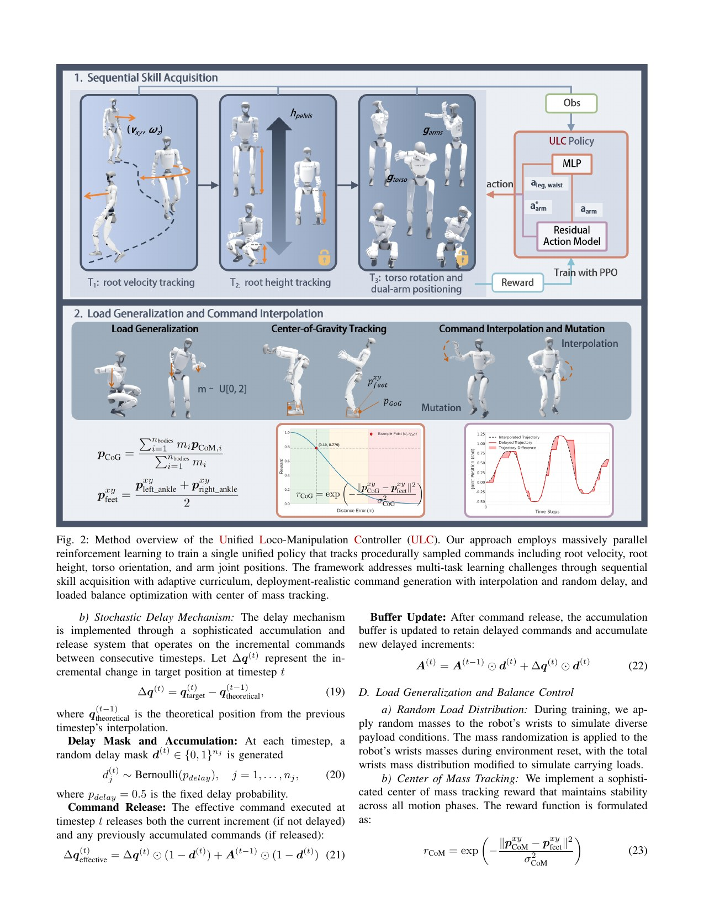
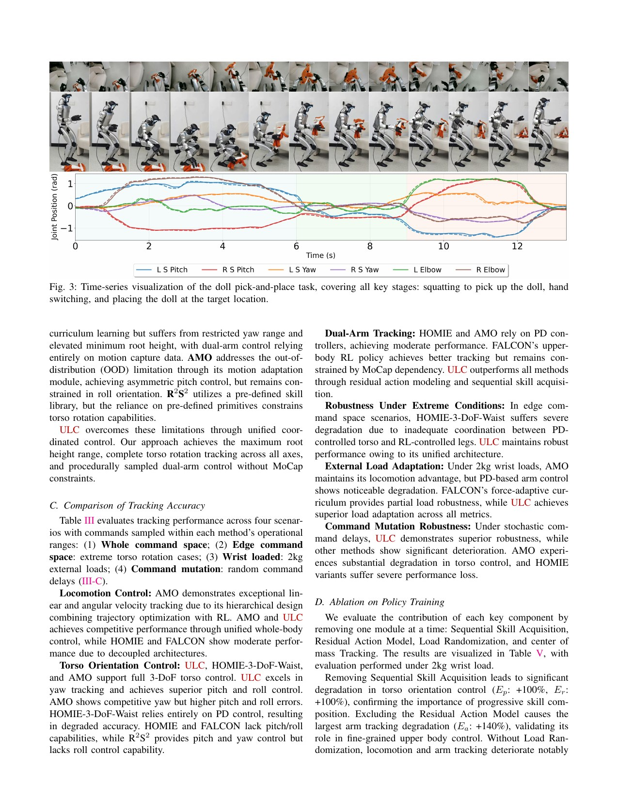
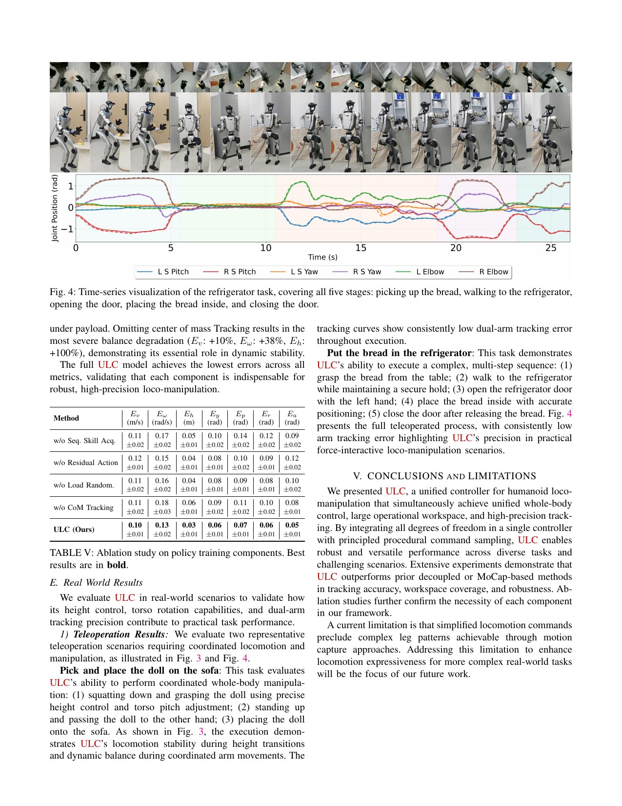

# ULC：用顺序技能课程训练单一精细移动操作策略

来源：[arXiv:2507.06905v2](https://arxiv.org/abs/2507.06905v2) · [官方项目页](https://hellod035.github.io/ULC/)

解读范围：完整 13 页正文与附录。官方项目页在截点仍标注 `Code (Coming Soon)`，故不使用第三方同名仓库。

> 一句话总结：ULC 把速度、根高、躯干方向和双臂关节目标放进一个策略，用顺序课程和“程序目标 + 残差修正”避免多任务奖励在训练早期相互拉扯。

术语导航：统一移动控制（unified loco-manipulation control）在一个 actor 中协调行走与上肢，顺序技能课程（sequential skill curriculum）逐组激活命令。残差动作（residual action）、前馈目标（feedforward target）、五次多项式插值（quintic interpolation）、命令延迟随机化（command-delay randomization）、质心投影（center-of-mass projection）和多目标干扰（multi-objective interference）是核心概念。

## 工程痛点

统一全身策略看似只是把更多命令拼到 observation，实际上会改变学习难度。速度跟踪容易在早期获得奖励，精细躯干方向和手臂姿态则需稳定支撑后才能进步。如果一开始就将所有目标以同等强度打开，策略会像同时学骑车、端水和瞄准一样，某一个奖励的偶然改善会破坏另一个。

另一个问题是上肢命令对精度敏感，直接让网络从零输出绝对关节目标，会浪费已知的程序化姿态。ULC 将命令当作前馈，策略只输出动态补偿，像先用地图给导航路线，再让驾驶员根据路况微调方向盘。

实机命令还会因遥操、网络和感知出现拖尾、延迟或突变。如果训练只见独立均匀指令，策略上机后可能把正常网络抖动当成快速动作要求。插值与延迟释放因此是接口分布设计，不是视觉上的平滑处理。

## 核心洞察

ULC 的核心是把训练顺序写成可观测、可触发的课程，而不是人工在某个 iteration 切换一份奖励配置。滑动奖励达到阈值后再开放新命令，并保留旧任务，让策略每一阶段都必须在不忘记基础能力的条件下扩展接口。

残差手臂的意义也不是动作幅值更小，而是把“用户意图”和“平衡补偿”拆成两条信号。程序目标保留上层要的关节姿态，策略修正外力、负载和身体加速带来的偏差。这个分解也使安全限幅可以分别作用在目标和修正量上。

但统一策略仍然不是统一安全证明。它将上肢异常和下肢步态放在同一网络内，增加了能力共享，也增加了故障传播路径。验收必须包含单命令、联合命令和突变命令，不能只测平滑的预定轨迹。

## 方法主线

ULC 用一个 29 维高斯策略同时跟踪根线/角速度、根高度、三轴躯干方向和双臂关节角。腿和躯干动作是默认姿态附近的缩放输出；手臂采用残差动作 `q_final = q_desired + q_processed`，让程序化命令作为前馈，网络只学动态补偿。

训练不是一次开放全部目标，而是按速度 → 高度 → 躯干/双臂顺序激活；每阶段依据滑动奖励阈值提升课程参数，并保留已学目标。五次多项式插值把随机命令变平滑，随机延迟释放模拟部署命令抖动；腕部 0–2 kg 负载随机化与质心投影到双踝中点的奖励帮助负载平衡。观测历史 6，仿真 0.005 s、decimation 4，对应 50 Hz 策略。

## 关键图解

Figure 2 从命令源读到关节动作：速度、高度、躯干和双臂目标先经平滑/延迟模块，再按课程进度进入单一策略。它展示的不是一个简单大 observation，而是一份有时序约束的命令协议。

- Figure 2：统一策略、程序化命令、顺序课程、插值/延迟和负载平衡全链路。
- Equations 25–26：手臂残差动作把目标关节角与学习修正分开。
- Table III：四类场景、每项 5 次 × 1024 环境 × 50,000 步；ULC 在大多数躯干、手臂和突变命令指标上最好，AMO 在部分速度指标更强。
- Table IV：ULC 覆盖 0.30–0.75 m 根高度、±2.62 rad yaw、较完整 pitch/roll 与程序化双臂空间；对照接口不完全同构，应把工作空间与精度分开读。
- Table V：在 2 kg 腕载荷下，移除顺序技能使 pitch/roll 误差约翻倍，移除残差使手臂误差从 0.05 增至 0.12，移除 CoM 跟踪使高度/角速度显著退化。
- Figure 3/4/5：G1 遥操作完成玩偶与冰箱多阶段任务；载荷对照中 ULC 比同增益 PD 更能保持双臂姿态，但未给任务成功率分母。

Table III 的优点是使用大规模统一评测，但 Table IV 提醒我们各方法的原生命令空间不同。因此误差更低和工作空间更广是两个问题：一个方法可能在它能接受的窄命令上很准，却无法表达大幅躯干和根高。

Table V 是整篇论文的机制中心。去掉顺序技能、手臂残差或 CoM 跟踪，受损指标不完全一样：这说明它们分别处理优化顺序、上肢精度和负载平衡，而不是三个可随意替换的“训练技巧”。

最强证据是 Table V，因为它把单体策略能训练成功拆解为四个必要组件，而不是只和接口不同的外部方法比平均分。Table III 的统一评测规模大，但部分 baseline 来自“忠实复现”，不同原生命令空间仍会影响公平性。

## 最有说服力的实验

Table V 比 Figure 3-5 的真机展示更能说明因果，因为它在同一训练框架下逐一去掉组件。在 2 kg 腕部载荷条件中，无顺序课程主要恶化躯干角误差，无残差主要恶化手臂误差，无 CoM 跟踪则破坏高度和角速度。这种“组件—失败模式”对应比总分更有复现价值。

实机玩偶和冰箱任务证明统一接口能被遥操链调用，但它们缺少试验总数、失败分类和对照。因而正确表述是“有真机可用性案例”，不是“已证明多阶段任务成功率”。复现时应按阶段记录接近、接触、操作和退出的成功分母。

## 公开实现状态

截至 2026-08-10，论文声称代码位于项目页，但该页按钮仍显示 `Code (Coming Soon)`，没有唯一作者仓库、提交或许可证。因而无法核对课程阈值实现、随机延迟队列、五次插值和残差动作符号。任何 `isaac-g1-ulc` 等第三方项目都不冒充官方代码。

## 局限与安全边界

作者明确指出，简化的速度型腿部命令无法产生 MoCap 方法中的复杂腿部图案。独立判断：只有一台三自由度腰 G1；真实任务多为定性遥操作；2 kg 负载仿真与 0.5/1/1.5 kg 实机静态手臂对照不能代表门碰撞或持续推拉；CoM 参考用双踝中点，未显式建模单支撑支持多边形；统一策略扩大耦合，也可能把上肢异常传播到步态。

上层突变命令与下层策略时钟也是未完全量化的边界。五次插值能限制理想指令的导数，却不能修复丢帧、时钟漂移或上层输出超出机器人可达空间。部署链应对命令年龄、幅值、速率和联合可行性做额外检查。

## 可执行但有边界的结论

训练统一多目标策略时，应把课程顺序、前馈+残差、部署延迟随机化和负载平衡做成独立消融。评估需分开命令范围、命令精度和多目标同时激活时的性能，不用一个平均误差概括全部能力。

实机验收仍需分任务报告成功率、跌倒/接管、接触峰值和热状态；项目官方代码尚未公开，也没有提供可直接复用的安全参数。

## 复现与验收清单

容易误读的第一点是将广命令空间当成均匀高精度工作空间。Table IV 只说明接口能表达的范围，不代表在范围边缘、高载荷和多命令同时激活时仍有相同误差。复现因此要在命令空间中做分层网格，而不是从中心均匀抽样后只报一个平均数。

第二点是 CoM 投影到双踝中点是一个简化平衡目标，不是准确的支持多边形或零力矩点约束。在单支撑、大步长或手与环境建立额外接触时，双踝中点可能与真实可行区不同。这些场景应作为单独 ODD 扩展，不直接由双脚负载结论外推。

第三点是官方代码尚未公开，因而论文中的阈值、队列和插值细节只能按文本重建。独立复现应明确标注自己的课程状态机、命令缓冲和残差实现，不因实验数值接近就声称与作者符号级一致。

第一份交付物应是命令字典，而不是策略权重。字典需列出根线/角速度、高度、躯干方向与双臂角的单位、坐标系、范围、采样分布、插值边界和超时行为。训练、仿真部署和真机遥操必须生成同一份接口校验和，防止欧拉角顺序或根坐标系不一致被误认成策略失败。

顺序课程需保存每个阶段的启用时刻、滑动奖励、阈值、新旧任务指标与回退情况。如果某个新命令开放后旧速度能力下降，不应只看总回报继续前进；课程触发条件要包含已学技能的保持门槛。这样才能把“不灾难性遗忘”从直觉变成可验证规则。

残差手臂应与绝对动作基线使用相同最终关节限位和总动作幅值。除了手臂跟踪误差，还要记录程序目标、学习修正量和最终目标的分布。若残差长期抵消上层命令，策略可能用“不执行意图”来换取平衡；这不应被平均全身回报掩盖。

命令延迟和平滑模块应用真实遥操日志校准。评估至少包含高斯延迟、突发延迟、丢帧、重复帧和目标跳变，并分别报告根速度、躯干、手臂与恢复时间。五次插值只规定理想输入曲线，对通信断流必须有另外的保持、超时与安全姿态逻辑。

真机任务需将“控制能力”与“任务管线”分开。玩偶与冰箱应按接近、稳定、接触、操作、离开五个阶段报告完整分母，并记录跌倒、人工接管、物体滑落、末端力与热状态。只有某一条成功视频无法判断统一策略是否在上肢失败时仍保持了下肢安全。

一个完整的联合命令压力测试还应要求高度、躯干和双臂同时接近各自范围边界，并在负载下加入速度变向。这些组合未必是常规任务，却能暴露统一策略的内部优先级：当所有目标无法同时满足时，它是保腿、保手、保躯干还是保速度。验收要将这种退化顺序明确化，并由外层安全逻辑限制不可接受的取舍，不能将它隐藏在奖励权重里。

> **金句**：统一策略不是把所有命令一次性丢给网络，而是让每个新自由度在不破坏旧能力的前提下获得发言权。
